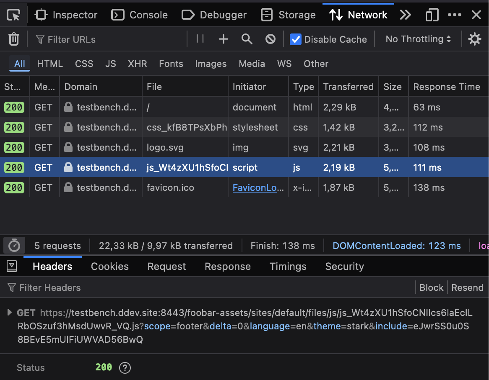
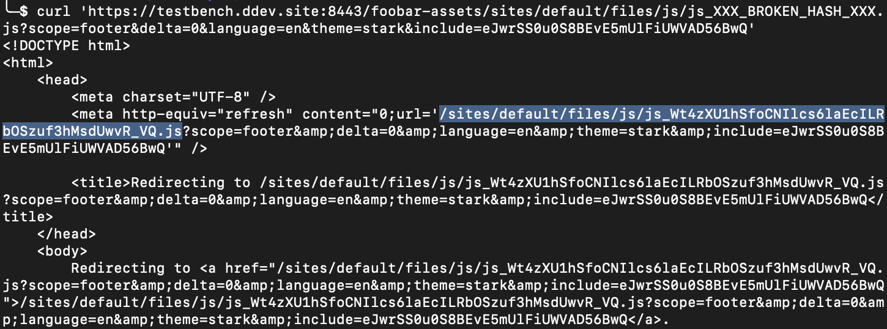

# Issue

```
ddev drush site-install --existing-config -y
ddev launch
```

Assets should be loaded from `/foobar-assets` directory.



However, if the file hash is incorrect for some reason, [`hook_file_url_alter`](./public/modules/test/test.module) is never run, and the file url will be incorrect.



Relevant files:
- [`hook_file_url_alter`](./public/modules/test/test.module)
- [`nginx-site.conf`](./.ddev/nginx_full/nginx-site.conf)
